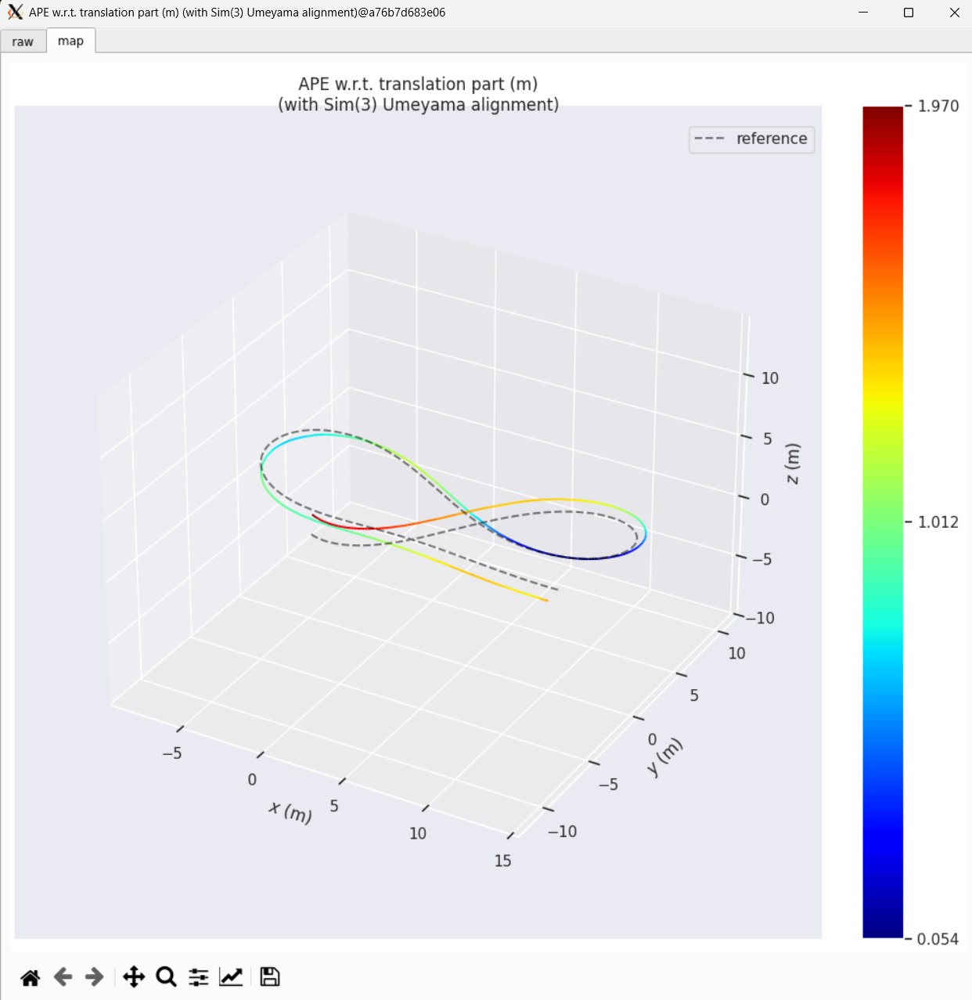

# Robotic Mapping and Localization SLAM Competition

 

This repository contains template code for a Visual Odometry system, intended as a starting point for the SLAM competition in the Robotic Mapping and Localization course. The provided C++ code (`vo_epipolar.cpp`) estimates camera trajectory using feature tracking (Optical Flow) and epipolar geometry.

## Devcontainer

The project is designed to work within a VS Code devcontainer environment. The `Dockerfile` in the `.devcontainer` folder builds an Ubuntu 22.04 image with necessary libraries, including:

* [OpenCV](https://opencv.org/) (>= 4.x)
* [Open3D](http://www.open3d.org/)
* [Eigen](https://eigen.tuxfamily.org/index.php?title=Main_Page)

These are required to compile and run the template code. The [EVO evaluation tools](https://github.com/MichaelGrupp/evo) are also built in the container for your convenience. 

## Setup and Compilation

1.  **Download Data:** Obtain the "Synthetic\_base" dataset from the provided [Google Drive link](https://drive.google.com/drive/folders/1EGJSNuiRqKSH7G6LL5qq5T7I0elXfW5L?usp=sharing).
2.  **Extract Images:** Uncompress the images within the dataset.
3.  **Place Data:** Copy the *entire* set of images into the `data > Synthetic_base > images` directory of this repository. The structure should look like:
    ```
    repository-root/
    ├── data/
    │   └── Synthetic_base/
    │       ├── images/
    │       │   ├── 0000000001.png
    │       │   └── ...
    │       ├── camera_calibration.json
    │       └── camera_trajectory_tum.txt
    ├── src/
    │   └── competition.cpp
    ├── .devcontainer/
    │   └── ...
    └── CMakeLists.txt
    ```
4.  **Open in Devcontainer:** Use VS Code's "Remote-Containers: Reopen in Container" command to build and open the project inside the defined Docker environment.
5.  **Configure Build:** Open a terminal within VS Code (which will be inside the container).
    ```bash
    mkdir build
    cd build
    cmake ..
    ```
6.  **Compile:** Run the make command. Using `-j` with the number of processors can speed up compilation.
    ```bash
    # Get number of processors and compile in parallel
    make -j$(nproc)
    ```

## Execution

1.  **Run Executable:** After a successful build, run the executable generated in the `build` folder from within the `build` directory:
    ```bash
    ./competition
    ```
    *(Note: The executable name might differ if you changed it in `CMakeLists.txt`)*
2.  **Processing:** The program will process the image sequence, estimate the camera's trajectory frame-by-frame, and display the current image with tracked features alongside an Open3D window showing the estimated path and camera frustum.
3.  **Output:** The estimated trajectory will be saved as a text file named `estimated_trajectory.txt` in the **`Synthetic_base` directory**. The format is the TUM trajectory format:
    `timestamp tx ty tz qx qy qz qw`
4.  **Evaluation:** You can evaluate the accuracy of the estimated trajectory (`data/Synthetic_base/estimated_trajectory.txt`) against the provided ground truth (`data/Synthetic_base/camera_trajectory_tum.txt`) using [EVO tools](https://github.com/MichaelGrupp/evo). Example command (run from the repository root):
    ```bash
    evo_ape tum data/Synthetic_base/camera_trajectory_tum.txt data/Synthetic_base/estimated_trajectory.txt --align --correct_scale --plot --plot_mode xyz --pose_relation trans_part
    ```

    *Example of EVO Plots:*

     


## Important Instructions

* Read and follow the [instructions](https://drive.google.com/file/d/1rHfo5CJ3Wx5QaeGd6Ev0oyXHM7T3cjtz/view?usp=sharing) posted with the final project description regarding how to submit/report the competition results.
* You must *NOT* modify any lines in the `Dockerfile` before line #130 (as specified in the project instructions). You are welcome to add packages or make modifications *after* this line if needed for your specific approach.
